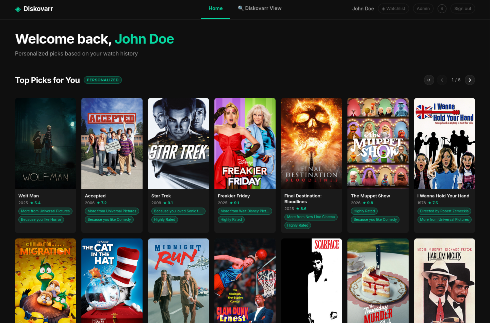

# Diskovarr

Personalized Plex content recommendations powered by your watch history.

Sign in with your Plex account and Diskovarr surfaces what to watch next — scored by your genre, director, actor, and decade preferences — with a full browse/filter view, private watchlist, and an admin panel to manage syncing, connections, and theming.



## Features

- **Plex OAuth sign-in** — users authenticate with their own Plex account via the official PIN flow; PIN is created browser-side so the server IP is never exposed in Plex's security warning
- **Personalized recommendations** — scored from Tautulli watch history across genre, director, cast, decade, and rating; fresh random sample drawn on every page load and shuffle
- **Four sections** — Top Picks, Movies, TV Shows, Anime (auto-detected by genre tag); each a 2-row carousel with pagination and a ↺ shuffle button
- **Diskovarr View** — full library browser with filters for type, decade, genre, min rating, sort order, and watched status
- **Detail modal** — click any card to open a full overlay with poster, Rotten Tomatoes scores, genres, summary, director and cast credits, and watchlist/dismiss actions
- **Diskovarr Requests** — optional tab showing content *not in your library*, scored by your preference profile; request directly to Overseerr, Radarr, or Sonarr with one click
- **Watchlist sync** — items sync to the native Plex.tv Watchlist by default; server owners can switch to **Playlist mode** (private "Diskovarr" server playlist) — useful when the Plex Watchlist triggers download automation (e.g. pd_zurg)
- **Dismiss** — hide individual items permanently per user; stored in SQLite
- **Background library sync** — cached in SQLite, refreshed from Plex every 2 hours; no cold-start delays
- **Per-user watched sync** — fetched via Plex admin token + accountID; syncs on first request then refreshes in background every 30 minutes
- **Admin panel** — password-protected; two tabs:
  - **Settings** — library sync, per-user caches, server owner, watchlist/playlist mode, theme color
  - **Connections** — configure Plex, Tautulli, TMDB, Overseerr, Radarr, and Sonarr with slide toggles and masked key fields
- **Version strip** — admin panel always shows running version with an update-available badge when a new GitHub release exists
- **Theme color picker** — color wheel + presets; accent color updates globally in real time
- **Poster proxy** — all poster images proxied through the server; Plex tokens never reach the browser
- **Dark UI** — Netflix-style card grid with shimmer skeleton loading, hover overlays, and CSS variable theming

## Requirements

- Docker (recommended) **or** Node.js >= 20
- Plex Media Server (local network access)
- Tautulli (for watch history used in preference scoring)

> **Note:** Diskovarr is designed for a **single Plex server and its users**. Users who sign in must have an account on your Plex server — the app verifies server membership during OAuth. It will not work correctly for Plex users who are not members of the configured server.

## Setup

### Docker (recommended)

```bash
git clone https://github.com/Lebbitheplow/diskovarr
cd diskovarr
cp docker-compose.yml docker-compose.override.yml
# Edit docker-compose.override.yml with your values
docker compose up -d
```

Open `http://your-server:3232` and sign in with your Plex account.

The library syncs from Plex on first startup (30–60 seconds depending on library size). Subsequent starts load from the local SQLite cache instantly.

> **Data persistence:** The `./data` directory is mounted as a volume and contains the SQLite databases. Do not delete it between updates.

#### Updating

```bash
docker compose pull   # if using a pre-built image
# or
docker compose build  # if building locally
docker compose up -d
```

### Bare metal (Node.js)

```bash
git clone https://github.com/Lebbitheplow/diskovarr
cd diskovarr
cp .env.example .env
# Edit .env with your values
npm install
npm start
```

#### Running as a systemd service

```bash
sudo nano /etc/systemd/system/diskovarr.service
```

```ini
[Unit]
Description=Diskovarr - Plex Recommendation App
After=network.target

[Service]
Type=simple
User=your-user
WorkingDirectory=/path/to/diskovarr
ExecStart=/usr/bin/node server.js
Restart=on-failure
RestartSec=5
EnvironmentFile=/path/to/diskovarr/.env
StandardOutput=journal
StandardError=journal

[Install]
WantedBy=multi-user.target
```

```bash
sudo systemctl daemon-reload
sudo systemctl enable --now diskovarr
```

## Configuration

### Required variables

| Variable | Description |
|---|---|
| `PLEX_URL` | Local URL of your Plex server, e.g. `http://192.168.1.x:32400` |
| `PLEX_TOKEN` | Plex admin token — used for library fetching and poster proxy |
| `PLEX_SERVER_ID` | Plex machine identifier (see below) |
| `PLEX_SERVER_NAME` | Display name for your server (shown in OAuth flow) |
| `ADMIN_PASSWORD` | Password for the `/admin` panel |
| `SESSION_SECRET` | Long random string used to sign session cookies |

### Optional variables

| Variable | Description |
|---|---|
| `TAUTULLI_URL` | URL of your Tautulli instance (can be set in admin panel instead) |
| `TAUTULLI_API_KEY` | Tautulli API key (can be set in admin panel instead) |
| `PLEX_MOVIES_SECTION_ID` | Library section ID for movies (default: `1`) |
| `PLEX_TV_SECTION_ID` | Library section ID for TV shows and anime (default: `2`) |
| `PORT` | Port to listen on (default: `3232`) |

> **Tip:** Plex URL, Tautulli URL/key, TMDB, Overseerr, Radarr, and Sonarr can all be configured or updated from the **Admin → Connections** tab without editing any files or restarting the server.

### Finding your Plex Machine ID

```
http://your-plex:32400/identity
```
The `machineIdentifier` field is your `PLEX_SERVER_ID`.

### Finding library section IDs

```
http://your-plex:32400/library/sections?X-Plex-Token=YOUR_TOKEN
```
Each `<Directory>` element has a `key` attribute — that is the section ID.

## Admin Panel

Visit `/admin` and enter your `ADMIN_PASSWORD`.

### Settings tab

- **Library Sync** — item counts and last sync time; trigger a manual full sync; enable/disable 2-hour auto-sync
- **User Watch Sync** — watched counts per user; re-sync or clear individual users' history
- **Recommendation Cache** — clear in-memory caches for all users or a specific user
- **Server Owner & Watchlist Mode** — select the server owner Plex account; toggle between Watchlist mode (native plex.tv Watchlist) and Playlist mode (private server playlist)
- **Theme Color** — pick from presets or the color wheel; change applies across all pages instantly

### Connections tab

Configure all external services here — no file editing or restarts needed:

- **Plex** — URL and admin token (editable with eye toggle)
- **Tautulli** — URL and API key
- **TMDB** — API key required to enable Diskovarr Requests
- **Diskovarr Requests** — toggle to show/hide the Requests tab for all users
- **Overseerr / Radarr / Sonarr** — URL, API key, and enable toggle per service; Test button to verify connectivity

All API keys are stored in the local SQLite database and masked in the UI. The eye button reveals a key on demand (admin session only).

## Diskovarr Requests

An optional tab that shows content **not in your Plex library**, personalised to your taste.

**To enable:**
1. Go to **Admin → Connections**
2. Enter and save a TMDB API key (free at [developers.themoviedb.org](https://developers.themoviedb.org))
3. Enable at least one request service (Overseerr, Radarr, or Sonarr)
4. Flip the **Diskovarr Requests** toggle on

Recommendations are sourced from TMDB based on your top watched movies and shows, filtered to exclude anything already in your library and anything not yet released. Each card shows why it was recommended and a Request button that routes to your configured service.

## How Recommendations Work

1. **Watch history** — fetches up to 1,000 movies and 2,000 episodes from Tautulli for the signed-in user
2. **Preference profile** — builds weighted maps of genres, directors, actors, and decades; recent watches (top 50) get a 1.5× multiplier; fully-watched items get a 1.3× completion bonus
3. **Scoring** — every unwatched, non-dismissed item is scored:
   - Genre overlap: up to 20 pts (each genre capped at 7 pts to prevent single-genre dominance)
   - Director match: up to 30 pts
   - Actor overlap (top 3 matches): up to 25 pts
   - Studio match: up to 15 pts
   - Decade preference: up to 8 pts
   - Star rating multipliers: 5-star items score 2.5×; low-rated items are suppressed
   - Reason tags shown on each card: "Because you like Sci-Fi", "Directed by X", "Starring Y"
4. **Top Picks diversity** — seeds from highest scorers then injects picks for top directors, actors, and studios to avoid genre-bubble results
5. **Watched filtering** — uses Plex admin token with `accountID` to reliably fetch watched state for all users including Friends and managed accounts

## Dependencies

| Package | Purpose |
|---|---|
| `express` | Web framework and routing |
| `express-session` | Session middleware |
| `connect-sqlite3` | SQLite-backed session store |
| `better-sqlite3` | Synchronous SQLite for library/watched/settings data |
| `ejs` | Server-side HTML templating |
| `dotenv` | Environment variable loading |

All HTTP requests to Plex, Tautulli, and TMDB use Node.js 20's built-in `fetch`.

## Development

```bash
npm run dev    # node --watch server.js (auto-restarts on file changes)
```

Logs go to stdout. In production (Docker), use `docker compose logs -f diskovarr`. With systemd, use `journalctl -u diskovarr -f`.

## License

MIT
